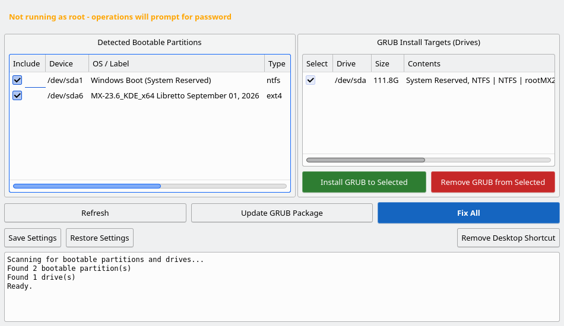

# Exxos Easy GRUB Manager

A simple GUI tool for managing the GRUB bootloader across drives on Debian-based Linux systems.



## Features

- **Detect bootable partitions** - opens each partition and checks it for a real installation,
  so backup and data drives are not listed as bootable. Anything skipped is explained in the log
- **Install / Remove GRUB** - install or remove GRUB on any drive with a single click
- **Update GRUB Package** - updates GRUB to the latest version, reinstalls to all drives, and regenerates the boot menu
- **Save / Restore Settings** - back up and restore your GRUB configuration files (grub.cfg, /etc/default/grub, /etc/grub.d/)
- **Fix All** - one-click repair: saves a backup, enables os-prober, reinstalls GRUB on the drives
  that already have it - and only those - and regenerates the config with all detected operating
  systems. If no drive has GRUB at all it falls back to the drive you booted from and says so
- **Desktop shortcut** - create or remove a desktop launcher from within the app
- **Progress bar** - visual feedback during all operations with controls locked to prevent accidental double-clicks
- Uses `pkexec` for root access (graphical password prompt, no terminal needed)

Every release is listed in [CHANGELOG.md](CHANGELOG.md).

## Install from APT

```bash
curl -fsSL https://exxosuk.github.io/exxos-easy-grub-manager/exxos-easy-grub-manager.gpg.asc \
  | sudo gpg --dearmor -o /etc/apt/trusted.gpg.d/exxos-easy-grub-manager.gpg
echo "deb https://exxosuk.github.io/exxos-easy-grub-manager stable main" \
  | sudo tee /etc/apt/sources.list.d/exxos-easy-grub-manager.list
sudo apt update
sudo apt install exxos-easy-grub-manager
```

**Note for anyone who installed 1.0.1:** the repository is now signed with the same key as the
other Exxos repositories. If `apt update` reports `NO_PUBKEY`, re-run the first command above to
fetch the current key, then `sudo apt update` again.

## Run

After installing, launch from the application menu or run:

```bash
exxos-easy-grub-manager
```

## Dependencies

- Python 3
- PyQt5
- GRUB (grub-pc or grub-efi-amd64)
- os-prober

## Tested on

- MX Linux 23 (KDE)
- Debian 12 (Bookworm)

## License

GPL-3.0
